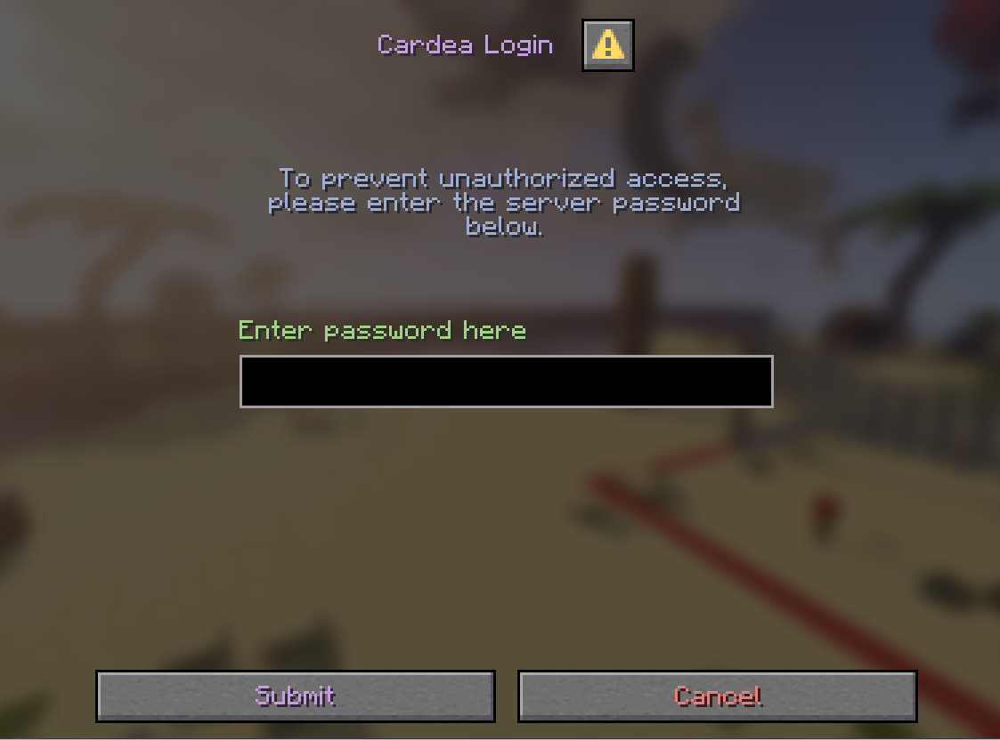

<h1 align="center">Cardea</h1>

Cardea is an open-source PaperMC plugin that provides an alternative to whitelisting a server. This is done by implementing a login dialog using the new DialogAPI introduced in Paper 1.21.7.

    

